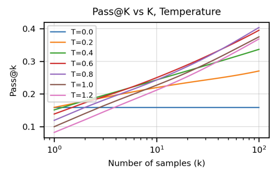

## The approach used for comparison
OpenAI has created [humanEval](https://arxiv.org/abs/2107.03374) benchmark to evaluate correctness of code generated by LLMs trained on code.
It consists of definition of pass@k metric and a set of 164 programming problems with varying difficulty levels with unit tests.

Pass@k can be interpreted as the result of evaluating the best out of k samples, where the best sample is picked by an oracle with prior knowledge of the unit tests.

They determined that the optimal temperature for pass@1 is T∗ = 0.2 and the optimal temperature for pass@100 is T∗ = 0.8 (see graph). 

 
There are 2 proposed ways to work 
I prefer pass@1 with low temperature to get more reliable code (as reliable as training data) due to the lesser probability or performance/memory degradation of security vulnerability introduced by randomness.

pass@1 with TopP 0.95 + temperature of 0.2 as recommended for pass@1 by OpenAI in HumanEval paper 

| Model | Gemini CodeAssist | GitHub Copilot | Amazon Q (CodeWhisperer) | Cursor | Qodo (Codium) |
| -- | -- | -- | -- | -- | -- |
